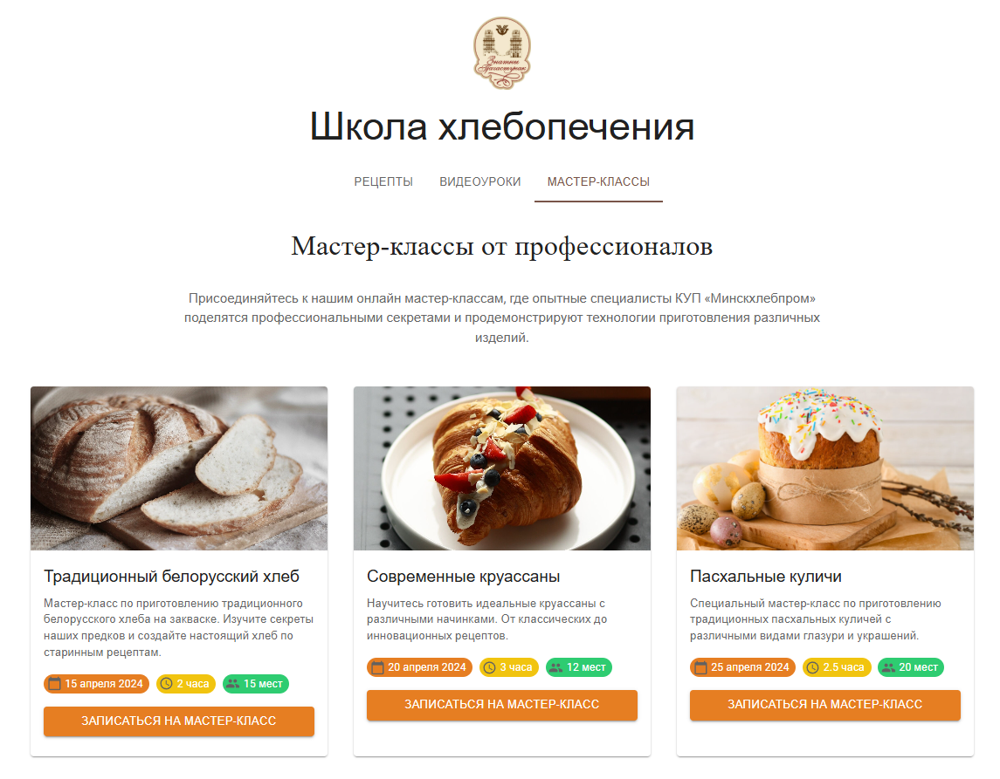
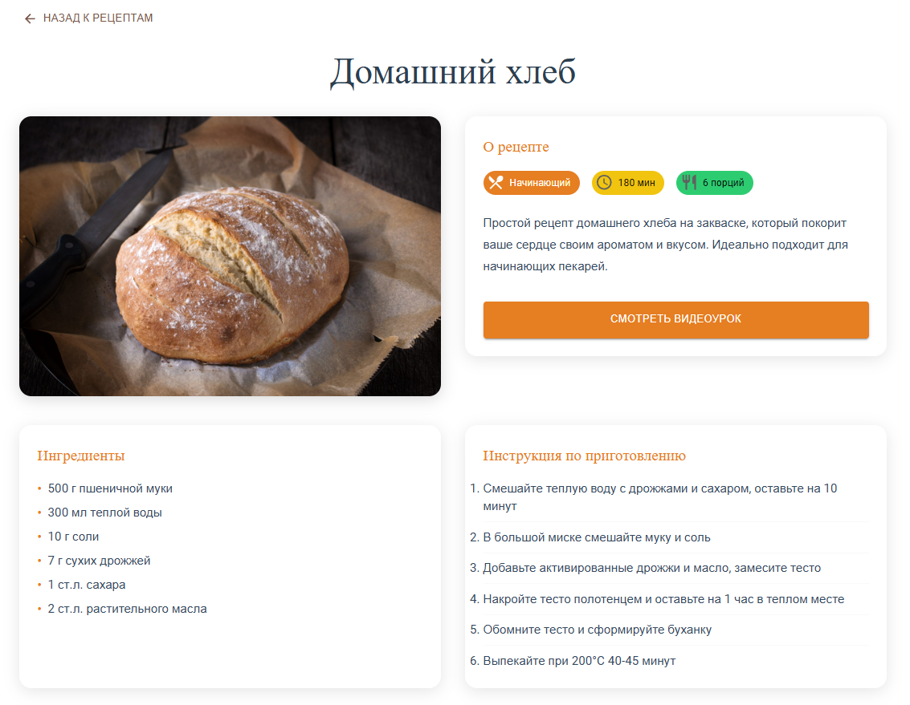

# Школа хлебопечения

Веб-приложение для обучения искусству хлебопечения с рецептами, видеоуроками и мастер-классами.

## Описание

Это полнофункциональное веб-приложение, разработанное для обучения пользователей различным техникам хлебопечения. Приложение включает в себя:

* **Рецепты**: Коллекция рецептов различной сложности
* **Видеоуроки**: Обучающие видео по хлебопечению
* **Профиль пользователя**: Отслеживание прогресса обучения
* **Избранное**: Сохранение любимых рецептов
* **История просмотров**: Отслеживание изученных материалов

## Скриншоты

### Главная страница с рецептами



Главная страница приложения с карточками рецептов, поиском и фильтрацией по сложности.

### Страница рецепта Домашний хлеб



Детальная страница рецепта с ингредиентами, инструкциями и возможностью просмотра видеоурока.

### Раздел видеоуроков


Страница с видеоуроками по хлебопечению, включая основы, багеты, круассаны и другие рецепты.

## Технологии

### Frontend

* React.js
* Material-UI (MUI)
* React Router
* Axios

### Backend

* Node.js
* Express.js
* MongoDB (планируется)

## Установка и запуск

### Предварительные требования

* Node.js (версия 14 или выше)
* npm или yarn

### Установка зависимостей

```bash
# Установка зависимостей для backend
npm install

# Установка зависимостей для frontend
cd frontend
npm install
```

### Запуск приложения

```bash
# Запуск backend сервера (из корневой папки)
npm start

# Запуск frontend (в отдельном терминале)
cd frontend
npm start
```

Backend будет доступен на порту 5000, а frontend на порту 3000.

## Структура проекта

```
bread-learning-platform/
 backend/           # Backend сервер
    server.js     # Основной файл сервера
    routes/       # Маршруты API
 frontend/         # React приложение
    src/
       components/  # React компоненты
       pages/       # Страницы приложения
       App.js       # Главный компонент
    public/          # Статические файлы
 images/            # Скриншоты и изображения
 README.md
```

## Функциональность

### Для пользователей

* Просмотр рецептов с фильтрацией по сложности
* Поиск рецептов
* Просмотр видеоуроков
* Отслеживание прогресса обучения
* Сохранение избранных рецептов
* Просмотр истории изученных материалов

### Планируемые функции

* Система регистрации и авторизации
* База данных для хранения рецептов и пользователей
* Система комментариев и оценок
* Интерактивные мастер-классы
* Мобильная версия приложения

## Автор

Проект создан для обучения веб-разработке и демонстрации возможностей современных технологий.

## Лицензия

MIT License
